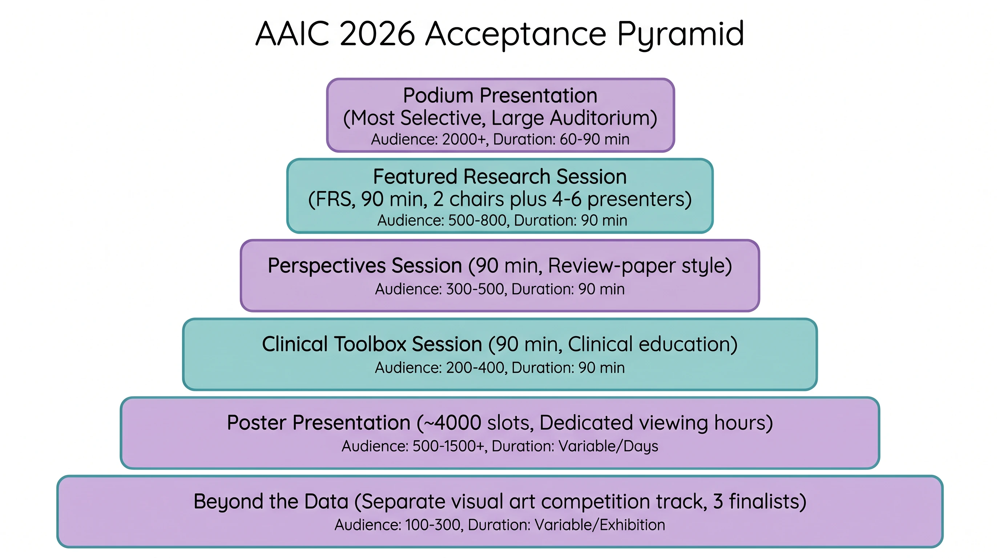
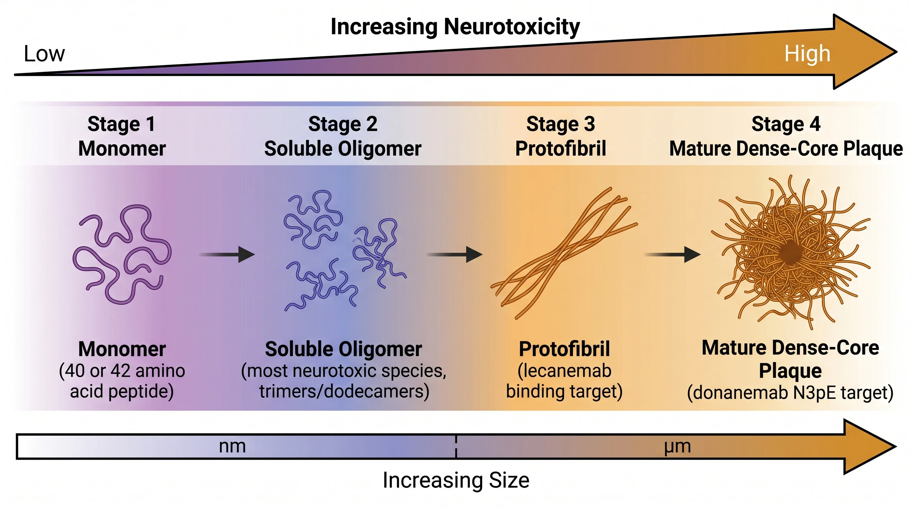
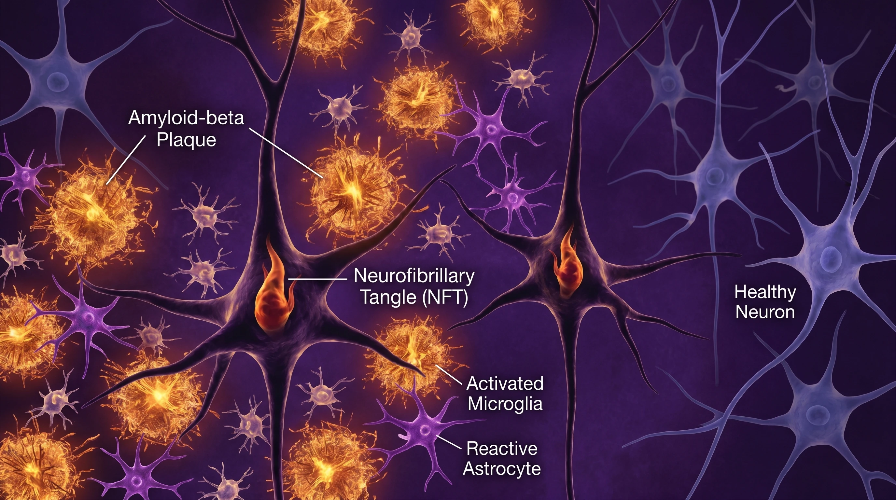
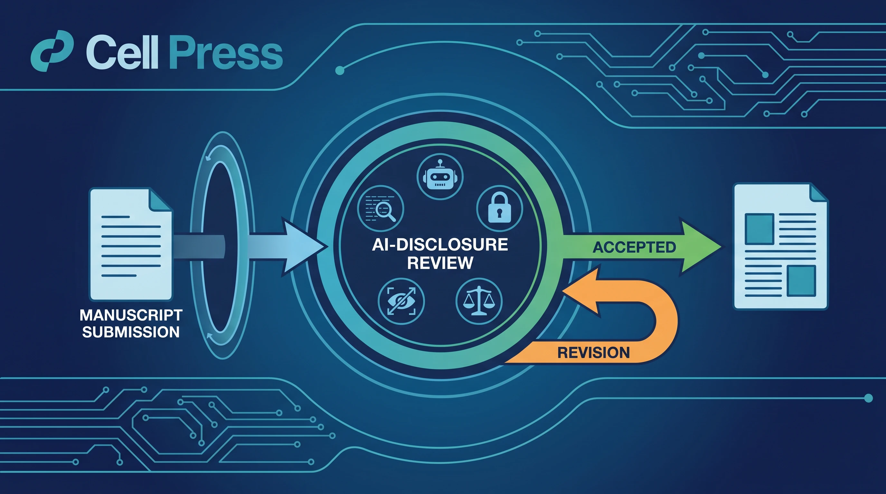
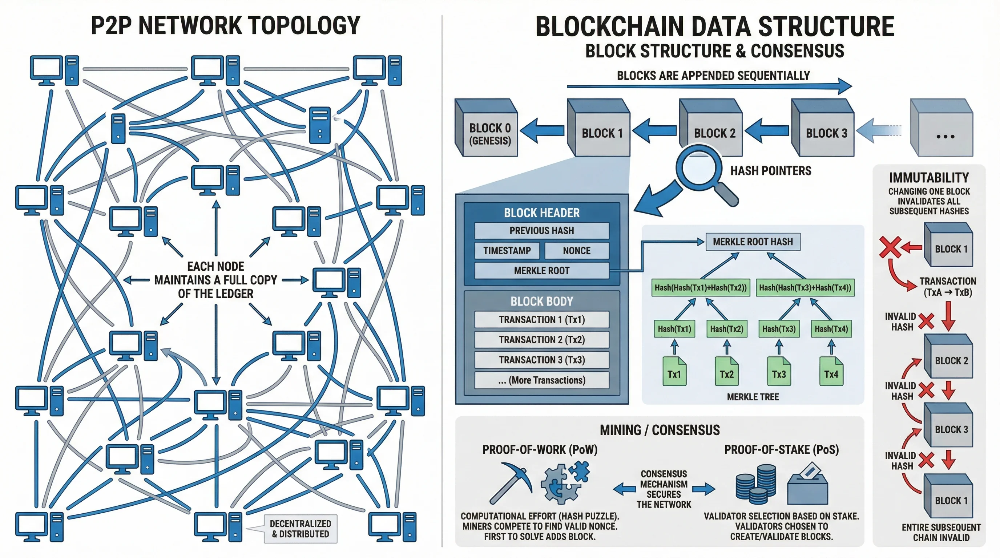
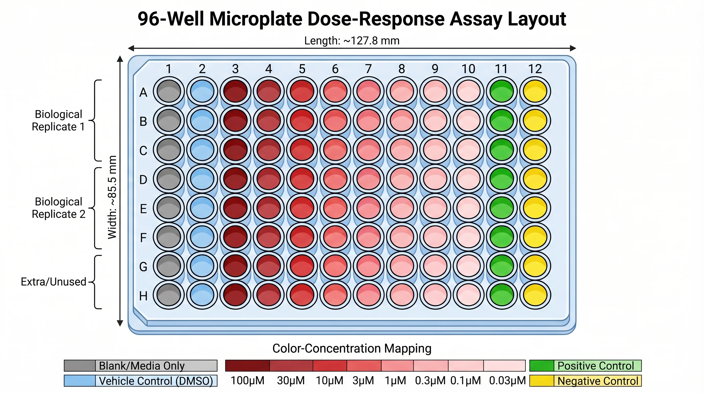

# SciFig — AI Scientific Illustrator

**From any input to a publication-ready scientific figure — editable at every step.**

Turn text, sketches, references, PDFs, and photos into publication-ready scientific figures in minutes, not hours.

---

## What is SciFig?

[**SciFig**](https://scifig.ai/?ref=github) is an AI scientific illustrator that helps researchers, educators, and students create publication-ready figures **without any design skills**. Describe an idea, upload a rough sketch, drop in a reference figure or a PDF method section — SciFig turns it into a clean, journal-ready graphic, and **every text label and element stays editable** afterwards.

> No more spending hours in Illustrator. No more hiring a designer for a single figure. No more fighting with PowerPoint shapes the night before a submission deadline.

Most general-purpose AI image tools hallucinate anatomy, invent mechanisms, and scramble labels. SciFig is built specifically for **scientific accuracy and editability** — so the figure you generate is one you can actually defend in review and drop straight into a manuscript.

## Six input modes → one publication-ready figure

SciFig meets you wherever your idea starts. Each mode is a dedicated tool:

| Input mode | What it does | Try it |
|---|---|---|
| **Text to Figure** | Describe a mechanism, pathway, or workflow in plain language → get a structured scientific figure | [scifig.ai/app/text-to-figure](https://scifig.ai/app/text-to-figure?ref=github) |
| **Sketch to Figure** | Upload a hand-drawn doodle or whiteboard photo → AI redraws it as a polished figure | [scifig.ai/app/sketch-to-figure](https://scifig.ai/app/sketch-to-figure?ref=github) |
| **Photo to Figure** | Turn a lab photo or microscopy image into a clean schematic illustration | [scifig.ai/app/photo-to-figure](https://scifig.ai/app/photo-to-figure?ref=github) |
| **Reference to Figure** | Provide an existing figure as a style/structure reference → generate your own variant | [scifig.ai/app/reference-to-figure](https://scifig.ai/app/reference-to-figure?ref=github) |
| **PDF to Figure** | Drop in a paper's method or results section → extract and visualize it as a figure | [scifig.ai/app/pdf-to-figure](https://scifig.ai/app/pdf-to-figure?ref=github) |
| **Figure Enhancer** | Multimodal enhance — refine, restyle, and upgrade an existing figure | [scifig.ai/app/figure-enhancer](https://scifig.ai/app/figure-enhancer?ref=github) |

And when you need pixel-level control, the [**Vector Canvas**](https://scifig.ai/app/vector-canvas?ref=github) converts any figure into a fully editable, layered vector you can re-label and recolor.

## Built for publication, not just pretty pictures

- **Every text editable** — labels, annotations, and captions remain editable after generation, no re-prompting required
- **Editable PPTX export** — drop the figure into slides with text layers intact
- **Layered SVG vectors** — infinitely scalable, compatible with Adobe Illustrator, Inkscape, and PowerPoint
- **8K PNG / JPG** — AI super-resolution keeps figures crisp at journal print sizes
- **6 publication styles** — flat illustration, schematic, isometric, and more, tuned for scientific communication

## See what researchers create

Real figures generated with SciFig, across disciplines:

| Graphical abstracts | Mechanisms & pathways |
|---|---|
|  |  |

| Micro-structures | Cross-sections & anatomy |
|---|---|
|  |  |

| Process & workflow | Journal covers |
|---|---|
|  |  |

| Systems & networks | Lab apparatus |
|---|---|
|  |  |

> Browse hundreds more in the [**SciFig Inspiration Gallery**](https://scifig.ai/inspiration?ref=github) — organized by graphical abstracts, mechanisms & pathways, micro-structures, cross-sections, process & workflow, journal covers, systems & networks, environments & ecologies, and lab apparatus.

## Who is it for?

- **Researchers & scientists** — figures for papers, grants, and conference posters
- **Graduate students** — thesis figures, defense slides, and technical roadmaps
- **Educators** — diagrams and visual explainers for teaching
- **Journal editors & science communicators** — TOC graphics, journal covers, and outreach visuals

## Getting started

1. Visit [**scifig.ai**](https://scifig.ai/?ref=github)
2. Sign up for free — no credit card required
3. Get **free daily credits** (50/day on the free plan, 100/day on paid plans) to start generating
4. Pick an input mode and create your first figure

See [**pricing**](https://scifig.ai/pricing?ref=github) for plans and credit packs.

## Learn more

- 🌐 **Website**: [scifig.ai](https://scifig.ai/?ref=github)
- 🎨 **Inspiration Gallery**: [scifig.ai/inspiration](https://scifig.ai/inspiration?ref=github)
- 🧠 **AI Models**: [scifig.ai/models](https://scifig.ai/models?ref=github)
- 📚 **Tutorials**: [scifig.ai/tutorials](https://scifig.ai/tutorials?ref=github)
- ✍️ **Blog**: [scifig.ai/blog](https://scifig.ai/blog?ref=github)
- 💲 **Pricing**: [scifig.ai/pricing](https://scifig.ai/pricing?ref=github)

## Agent / Codex skill

Using Codex, Claude Code, or another agent? Install the companion
[**SciFig Scientific Figure skill**](https://github.com/lilingm963/scifig-ai-scientific-figure-skill)
to turn research ideas into figure prompts and drafts directly inside your agent workflow.

## License

SciFig is a commercial SaaS product. This repository is the public-facing project page and issue tracker. Open an issue for bug reports, feature requests, or feedback.

---

**[Try SciFig Free →](https://scifig.ai/?ref=github)** · Made for researchers who'd rather do research than fight with vector tools.

