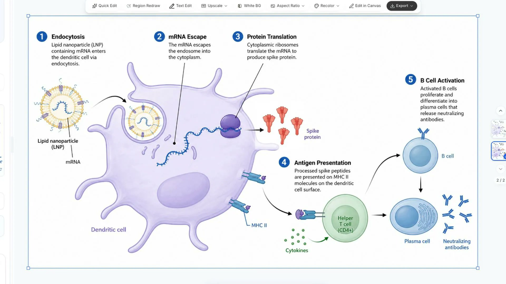
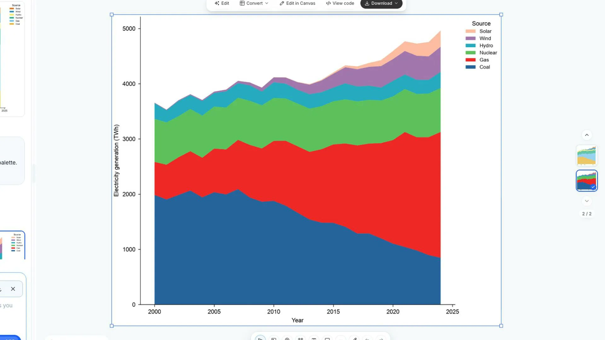
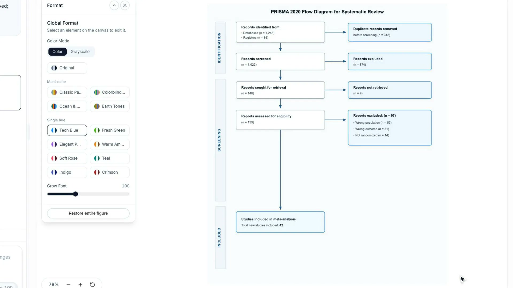

# SciFig

[English](README.md) · [中文](README.zh.md) · [Français](README.fr.md) · [Español](README.es.md) · [Italiano](README.it.md) · [Deutsch](README.de.md) · [日本語](README.ja.md) · [한국어](README.ko.md)

## Ideas, data and research workflows — made visual.

SciFig brings Illustration, DataChart and FlowChart into one platform for scientific communication. Explore the workflows, try the examples and find reusable public resources.

[Open SciFig](https://scifig.ai/?ref=github-resources) · [View all tutorials](https://scifig.ai/tutorials?ref=github-resources) · [Official media library](docs/media-library.md)

## Three workspaces

### Illustration

Turn descriptions and reference material into scientific illustrations, then refine the result with the available editing tools.

[See the complete workflow](https://cdn.scifig.ai/images/media-kit/2026-10/videos/v4-illustration-tutorial.mp4) · [View all tutorials](https://scifig.ai/tutorials?ref=github-resources)

### DataChart

Build charts and graphs from tabular inputs and refine their presentation. Check values, units, axes and legends against your source data.

[See the complete workflow](https://cdn.scifig.ai/images/media-kit/2026-10/videos/v4-datachart-tutorial.mp4) · [View all tutorials](https://scifig.ai/tutorials?ref=github-resources)

### FlowChart

Visualize research processes and structured workflows, then adjust nodes and relationships in the editor.

[See the complete workflow](https://cdn.scifig.ai/images/media-kit/2026-10/videos/v4-flowchart-tutorial.mp4) · [View all tutorials](https://scifig.ai/tutorials?ref=github-resources)

Review scientific meaning, labels and sources before sharing. Editing and export options depend on the workspace and workflow; the tutorials show specific examples.

## Try three examples

These inputs are synthetic teaching examples, not experimental evidence. The tutorial previews demonstrate separate product workflows; they are not outputs generated from these example inputs.

[Try three examples](examples/README.md)

## Public resources

### Poster and presentation templates

Browse 154 PPTX files by print size or presentation purpose. Preview the layouts and check the template license before reuse.

[Poster and presentation templates](https://github.com/scifig-ai/scientific-poster-and-presentation-templates)

### Scientific Figure Skill

Structure a figure and prepare prompts in an agent. Generation uses the agent’s available image tool or your configured image API; this Skill does not call a SciFig API.

[Scientific Figure Skill](https://github.com/lilingm963/scifig-ai-scientific-figure-skill)

### Official media library

35 finished videos, localized packs, captions and product previews. Files stay on the official CDN; this repository provides the catalog and usage guidance.

[Official media library](docs/media-library.md)

## The person behind SciFig

Alex Carter is SciFig’s founder and independent developer. His public work includes the platform, research poster and presentation templates, practical guides and this resource collection. See About for the editorial standards and contact details.

[About and editorial standards](https://scifig.ai/about?ref=github-resources)

## Licenses and usage

SciFig is a commercial platform. This repository is a public resource hub, not the product source code. Media, templates and the MIT-licensed Skill have separate terms; none grants blanket rights to the other materials.

[Media material usage terms](https://scifig.ai/media-kit?ref=github-resources#usage) · [MIT](https://github.com/lilingm963/scifig-ai-scientific-figure-skill/blob/main/LICENSE) · [Poster and presentation templates](https://github.com/scifig-ai/scientific-poster-and-presentation-templates/blob/main/LICENSE)

## Feedback and requests

Open an issue for resource corrections or requests. Do not post private research data or account details. For account help, use the official contact page.

[Feedback and requests](https://github.com/lilingm963/SciFig-AI/issues) · [Feedback and requests](https://scifig.ai/contact?ref=github-resources)

## Resource updates

October 2026: refreshed the public introduction for three workspaces; organized 35 videos and eight-language captions; added three synthetic teaching examples and linked the public resources.
